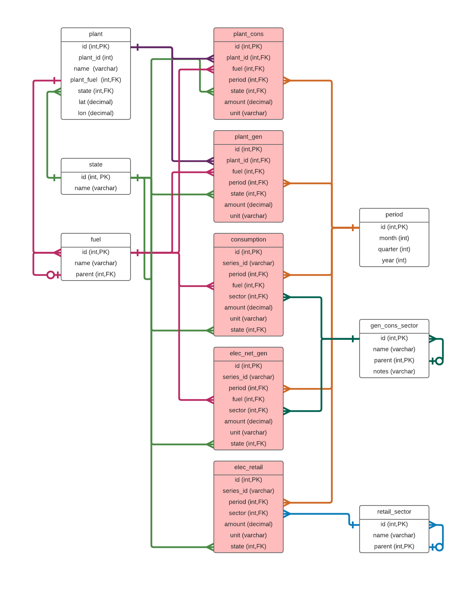

# The Database
We've used mysql as our database system. For the transformations you can use what system you like, but for the dashboard you might have to change the queries.

The schema relevant for the dashboard (excluding categories)

The dimensions are in white while the facts are red. The color of the connections is determined by the connection, just to have a better overview.

The full schema also has *category* and *category_tree*, which are just used for the transformations.
Also there is *plant_type* which isn't used anywhere. Just exists. See below.

# Dimensions

## plant
This dimension holds the informations regarding a plant.
 - id : The (internal) plant-id. Not to confuse with the original plant-id, which is saved in plant_num
 - plant_id : This is the original ID of the plant that is used in the ELEC.txt
 - name : Name of the plant
 - plant_fuel : The type of fuel this plant uses (solar and wind are also considered fuels.)
 - state : State the plant is in
 - lat/lon : Latitude/Longitude of the plant.

### Open Issues
We have the issue of plant-rows where all of the fields, except the *id* and *name* are `NULL`. There must be something wrong with the transformation.
But this didn't bother as that much, we just ignored the rows and it didn't slow the queries that much. (After we shrinked the table down to ~8k rows from >1million, we didn't care that much)

## fuel
Here we have all the fuel/source-types used to generate electricity. There are different fuel-types used in *plant_cons* and *elec_net_gen*.
They have some in common, but *plant_cons* did introduce it's own.
- id : The (internal) id for the fuel-type
- name : The name to display for that type
- parent : Never used. Initially thought to be used, so we could do something like 'Get all solar-plants (no matter if photovoltaic, solar, utility-scale or distributed)', or 'Give me all the coal-fuels'.
We thought the information for that would be in the export, as [electricity browser](http://www.eia.gov/electricity/data/browser/) of the EIA suggest it. But it wasn't, so this columsn remains empty and unused.

## state
The codes for the 51 states of the USA. All of them start with 'US-' followed by the 2-character code of the state.
There were actually some rows in the source with multiple states, like 'USA-TX+USA-NV+USA-OR'. We didn't want do handle that mess and had no use for that sort of information. So we filtered them out.
Also we renamed 'USA-??' to 'US-??', just because we used jvectormap, which expected this format for the states.
- id : The (internal) id for the state (so has nothing to do with position or ranking. Just the order they come in)
- name : state-code

Also we filtered out 'USA' as state. It had all the numbers aggregated, which was kind of useless for us, as we would do that ourselves, if needed.

## period
Period. Just because Oracle Database or MySQL got confused when we used 'time'. We were lazy for `` `time` ``, so to be sure we don't get any problems, we named it 'period'.

- id : The (internal) id for this period (year-month).
- month : The month of the year.
- quarter : The quarter of the year.
- year: *The* year.

## gen_cons_sector
The sectors for the *elec_net_gen* and *consumption* facts. They share the same sectors, so they should share the same dimension-table.
- id : The (internal) id for this sector
- name : The name to be shown
- parent : just because fuel had a parent, and it would also make sense to have parents for sectors.
- notes : Notes. Never used, always empty. But the source has a note field, and it might have been important.

## retail_sector
The same as *gen_cons_sector* , but for the *consumption* table.
 Also has the same fields except *notes*.

## plant_type
This table isn't used for anything. No table references this and no queries are created.
One could use this to filter for a plant-type (like 'give me all steam turbines'), but in most cases thats not really usefull information.
For example, when getting all steam-turbine-plants we have coal, oil and nuclear.  But one might need data about plant-types. So feel free to reference this and use as you wish.
- id : The (internal) id for this type.
- name : name of the type

# Facts

## plant_cons
This saves the amount of fuel the plants consumed. Sources like solar and wind don't appear here, since they aren't really consumed.
Only fossil fuels (and nuclear, if you don't count that as fossil) make sense in the sense of consumption.

- id : Just an ID to have an ID. There is no real use, other than to filter for that.
- plant_id : Reference to the plant-dimension. Note that the **id** is reference and not the **plant_id**. Bad naming, but it's as it is now.
- fuel : Reference to the fuel-dimension.
- period : Reference to the period-dimension.
- state : Reference to the state-dimension.
- amount : The consumed amount (the fact/metric/value)
- unit : The unit of the amount. You can make use of this to be sure you compare the same units or convert between them to compare.
Right now there are 3 units: barrels, mcf ([1,000 cubic feet](http://www.eia.gov/tools/faqs/faq.cfm?id=45&t=8)) and tons.

## plant_gen
This saves how mot electricity a plant generated.
- id : Just an ID to have an ID. There is no real use, other than to filter for that.
- plant_id : Reference to the plant-dimension. Note that the **id** is reference and not the **plant_id**. Bad naming, but it's as it is now.
- fuel : Reference to the fuel-dimension.
- period : Reference to the period-dimension.
- state : Reference to the state-dimension.
- amount : The consumed amount (the fact/metric/value)
- unit : The unit of the amount. You can make use of this to be sure you compare the same units or convert between them to compare.
Right now there is only megawatthours.

## consumption
Here we save the consumption per fuel-type and sector over time.
- id : Just an ID to have an ID. There is no real use, other than to filter for that.
- series_id : The series_id this row originated from. This is only useful when debugging, if you want to check the original file if the numbers are correct.
- period : Reference to the period-dimension.
- fuel : Reference to the fuel-dimension.
- sector : Reference to the sector-dimension.
- amount : The consumed amount (the fact/metric/value)
- unit : The unit of the amount. You can make use of this to be sure you compare the same units or convert between them to compare.
Right now there are 3 units: thousand barrels, thousand mcf ([1,000 cubic feet](http://www.eia.gov/tools/faqs/faq.cfm?id=45&t=8)) and thousand tons.
- state : Reference to the state-dimension.

## elec_net_gen
Here we save the electricity generation per fuel-type and sector over time.
- id : Just an ID to have an ID. There is no real use, other than to filter for that.
- series_id : The series_id this row originated from. This is only useful when debugging, if you want to check the original file if the numbers are correct.
- period : Reference to the period-dimension.
- fuel : Reference to the fuel-dimension.
- sector : Reference to the sector-dimension.
- amount : The consumed amount (the fact/metric/value)
- unit : The unit of the amount. You can make use of this to be sure you compare the same units or convert between them to compare.
Right now there is only 1 unit: thought megawatthours.
- state : Reference to the state-dimension.

## elec_retail
Here we save the electricity sales per sector over time. Only the amout, not the price.
- id : Just an ID to have an ID. There is no real use, other than to filter for that.
- series_id : The series_id this row originated from. This is only useful when debugging, if you want to check the original file if the numbers are correct.
- period : Reference to the period-dimension.
- sector : Reference to the (retail-)sector-dimension.
- amount : The consumed amount (the fact/metric/value)
- unit : The unit of the amount. You can make use of this to be sure you compare the same units or convert between them to compare.
Right now there is only 1 unit: thought megawatthours.
- state : Reference to the state-dimension.